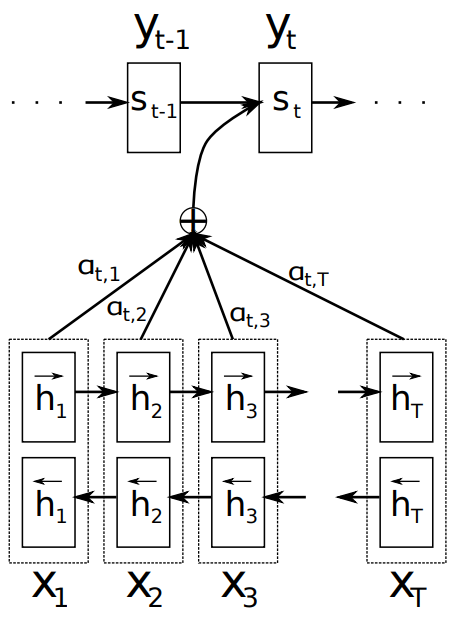
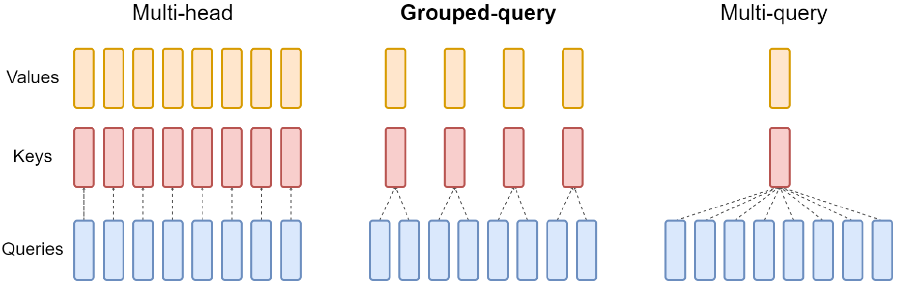

# Attentions Mechanism
Attentions mechanism is a pivot of current deep learning models. Its allows the model to capture the relationships of input sequances. 
## Additive-Attention

<div style="text-align: center;">
  <table style="margin: 0 auto;">
    <tr>
      <td align="center">
        
      </td>
    </tr>
    <tr>
      <td align="center">
        <em>Fig1. Additive Attention</em>
      </td>
    </tr>
  </table>
</div>

The encoder of method based on Bidirectional RNN (BiRNN) to capture the relationships of preceding and following words. Simply, BiRNN is an forward (from $x_{start}$ to $x_{end}$) and backward RNN (from $x_{end}$ to $x_{start}$) (donated by bottom part in Fig1), where $x$ is the input sequances. From forward and backward, RNN produced the hidden states $h_f$ and $h_b$ of each input sequances and concatetating both hidden states $h_j = \left[ h_f ; h_b\right]$.
Let say $h_j$ as query for next explanation, this query contains the summaries of preciding and following word due to concat the $h_f$ and $h_b$.

The decoder takes query ($h_i$) and last hidden states ($s_i$) to feed to *alignment model* :
```math
e_{t, i} = a(s_{t-1}, h_i)
```
where $a(\cdot)$ is
```math
a(s_{t-1}, h_i) = \text{v}^T \tanh(\text{W}_h h_i + \text{W}_s s_{t-1})
```
> The operation "+" makes this method named by *additive*.  
## Dot-Product Attention

## Multi-Head Attention (MHA)

## Mult-Query Attention (MQA)

## Group-Query Attention (GQA)

GQA is a combination of multi head and multi query attention with one key and value heads of each sub-groups of query.

<div style="text-align: center;">
  <table style="margin: 0 auto;">
    <tr>
      <td align="center">
        
      </td>
    </tr>
    <tr>
      <td align="center">
        <em>Fig4. Comparative MHA, GQA, MQA</em>
      </td>
    </tr>
  </table>
</div>

- **Multi-Head Attention (MHA)** : Every queries head have unique keys and values. Require big memory bandwidth, make it slow when inference. 
- **Multi-Query Attention (MQA)** : Every queries heads have single keys and values. Less memory bandwidth compare to MHA, but the quality become less and lead instability while training.
- **Grouped Query Attention (GQA)** : Queries divides to *G* groups. Each group have unique keys and values. Less memory bandwidth than MHA, and better quality than MQA.

### How it works?
**TODO**

## Flash Attention

## Flash Attention-2

#### References :
- [Self-Attention Paper](https://arxiv.org/pdf/1409.0473)
- [MHA Paper](https://arxiv.org/pdf/1706.03762)
- [MQA Paper]()
- [GQA Paper](https://arxiv.org/pdf/2305.13245) 